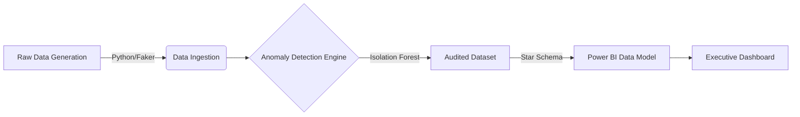

# Procurement Reporting Dashboard & Compliance Engine

## Executive Summary

**Project Type:** End-to-End Business Intelligence & Data Engineering Solution
**Target Domain:** Government Procurement (Public Sector)
**Tech Stack:** Python (Pandas, Scikit-Learn), Power BI, GitHub Pages (Static Artifact Deployment)

This repository hosts a robust **Procurement Intelligence Suite** designed to simulate the "Audit & Reporting" workflow of a government ministry (specifically modeled after the **Ministry of Technology & Innovation**). It automates the ingestion of raw vendor spend data, applies an **Unsupervised Machine Learning** model to detect financial anomalies, and visualizes actionable KPIs via an interactive Power BI dashboard.

**Key Value Proposition:**

* **Reduced Risk:** Automates the detection of non-compliant contracts using statistical outlier detection (Isolation Forest).
* **Operational Efficiency:** Replaces manual Excel reconciliation with a "One-Click" Python pipeline (`run_pipeline.sh`).
* **Data Sovereignty:** Demonstrates a "Static Artifact" deployment strategy, ensuring sensitive financial data remains within a secure, air-gapped environment while still providing executive visibility.

---

## System Visuals & Architecture

### 1. Executive Intelligence View

*Financial oversight dashboard integrating Python-generated compliance datasets. Features "Budget Variance" analysis and "Spend by Ministry" breakdowns.*

### 2. ML-Driven Anomaly Detection

*Isolation Forest model output visualized within Power BI. Red nodes indicate contracts deviating >2 standard deviations from peer spending clusters (High Budget / High Variance).*

*(See `docs/assets/dashboard_interaction.gif` for a video demonstration of filter interactivity.)*

---

## Technical Architecture

The solution follows a standard **ETL (Extract, Transform, Load)** pattern enhanced with an AI auditing layer.



### 1. Data Engineering Layer (Python)

* **Generation (`scripts/data_generator.py`):** Uses the `Faker` library with `en_CA` localization to generate realistic, compliant-looking procurement records (Vendor Names, Canadian Postal Codes, Ministry Classifications).
* **Logic:** Implements "Constrained Randomness" to simulate real-world variance (e.g., `ActualSpend` is derived from `Budget` * `VarianceMultiplier`, creating a realistic linear correlation).

### 2. Data Science Layer (Scikit-Learn)

* **Auditing (`scripts/anomaly_detector.py`):** Deploys an **Isolation Forest** algorithm to identify "Unknown Unknowns."
* **Why ML?** Traditional rule-based audits (e.g., `IF Spend > $1M`) fail to catch subtle fraud (e.g., a $50k contract with $49k spend that is statistically rare for that specific category).
* **Configuration:** The model is tuned with `contamination=0.05`, flagging the top 5% of statistical outliers for human review.

### 3. Business Intelligence Layer (Power BI)

* **Data Model:** Star Schema architecture (Fact Table: `Procurement_Data`, Dimensions: `Dim_Category`) to optimize the VertiPaq engine for sub-second filtering.
* **Measures (DAX):**
* `% Budget Variance` (Safe Division pattern).
* `Compliance Rate` (Context Transition logic).
* `Anomaly Score` (Visualized via Scatter Plot).


---

## Security & Deployment Strategy

### Architecture Decision Record (ADR): Static Artifacts

**Constraint:** This project mimics a **Protected B** government environment. Publishing live internal financial data to the public web (via Power BI "Publish to Web") violates data sovereignty and security policies.

**Solution:**
We utilize a **Static Artifact Deployment** pattern.

* **Secure Core:** The live `.pbix` binary and raw CSV data remain confined to the local development environment (simulating an air-gapped zone).
* **Public Facade:** High-fidelity captures and GIFs are rendered here on GitHub to demonstrate functionality without exposing the underlying dataset to public scraping or unauthorized access.

*(For a deep dive on this architecture, see `docs/hosting_concepts.md`)*

---

## Installation & Usage

To replicate this analysis locally:

### Prerequisites

* Python 3.8+
* Power BI Desktop (Windows Only)

### Step 1: Clone & Setup

```bash
git clone https://github.com/YOUR_USERNAME/procurement-reporting-dashboard.git
cd procurement-reporting-dashboard
pip install -r requirements.txt

```

### Step 2: Run the Pipeline

Generate fresh mock data and run the anomaly detection audit in one step:

```bash
# Linux/Mac
./run_pipeline.sh

# Windows (PowerShell)
python scripts/data_generator.py
python scripts/anomaly_detector.py

```

*Output: `data/processed/procurement_data_audited.csv*`

### Step 3: View the Dashboard

1. Open `powerbi/Procurement_Dashboard.pbix` in Power BI Desktop.
2. Click **Refresh** to load the newly generated data.
3. Explore the "Anomaly Detection" tab to see the ML model in action.

---

## 📂 Repository Structure

```text
procurement-reporting-dashboard/
├── data/                  # Raw and Processed (Audited) datasets
├── scripts/               # ETL and ML Python scripts
├── powerbi/               # .pbix Binary File
├── docs/                  # Architecture & Security Documentation
│   ├── assets/            # Screenshots & GIFs
│   └── hosting_concepts.md
├── run_pipeline.sh        # Automation wrapper
└── README.md              # Project Documentation

```

---

## Author Notes

**Role Target:** IT Reporting Officer (Ministry of Technology & Innovation)
**Focus:** This project was built to demonstrate proficiency in the specific competencies required for the role:

1. **"Configure and manage reporting tools"** -> Power BI Star Schema Design.
2. **"Automate reporting processes"** -> Python/Pandas ETL Pipelines.
3. **"Audit procurement files"** -> ML-Based Anomaly Detection.

*Built with ❤️ and Python.*