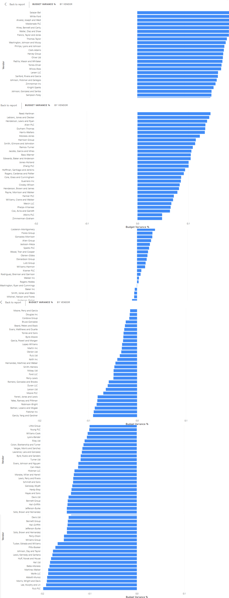
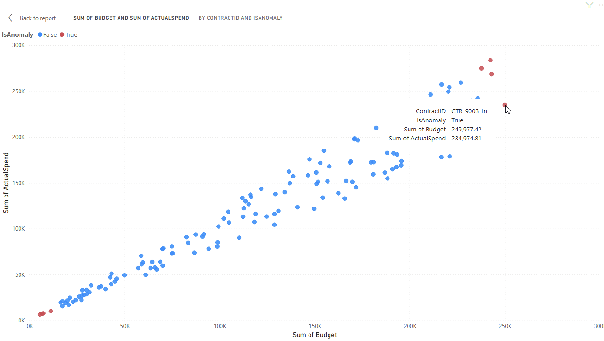

# Executive Summary

**Role Target:** IT Reporting Officer | Ministry of Technology & Innovation  
**Tech Stack:** Python (Pandas/Scikit-Learn), Power BI, GitHub Actions

This project implements an **Automated Continuous Audit** pipeline for government procurement. It replaces reactive Excel-based reporting with a proactive, AI-driven anomaly detection engine.

---

## 🎥 System Demo
*9-second interactivity proof: Filtering "Hardware" contracts triggers instant ML re-scoring.*

<video width="100%" controls autoplay loop muted>
  <source src="assets/dashboard_interaction.mp4" type="video/mp4">
  Your browser does not support the video tag.
</video>

---

## 📊 High-Fidelity Artifacts

### 1. The Executive Dashboard
*Provides "At-a-Glance" budget variance analysis across all ministries.*

### 2. ML-Driven Audit Layer
*The "Scatter Plot" visualizes the Isolation Forest algorithm. Red nodes are automatically flagged anomalies.*

---

## 📚 Engineering Documentation (Deep Dives)

This project follows a **"Docs-as-Code"** philosophy. Explore the architectural decisions below:

* **[🏗️ System Architecture & Data Flow](architecture.html)** *Blueprints of the ETL pipeline and Star Schema design.*

* **[🤖 Anomaly Detection Logic (ML)](anomaly_detection_concepts.html)** *Why we used Isolation Forest over simple rules (The "Unknown Unknowns" problem).*

* **[🎲 Data Generation & Privacy](data_generation_concepts.html)** *How we used `Faker` and seeds to ensure idempotency and privacy compliance.*

* **[⚡ Power BI & DAX Optimization](powerbi_concepts_deep_dive.html)** *VertiPaq engine mechanics and Star Schema performance strategies.*

* **[ Security & Hosting Strategy](hosting_concepts.html)** *Why we chose Static Artifacts over "Publish to Web" (Data Sovereignty).*