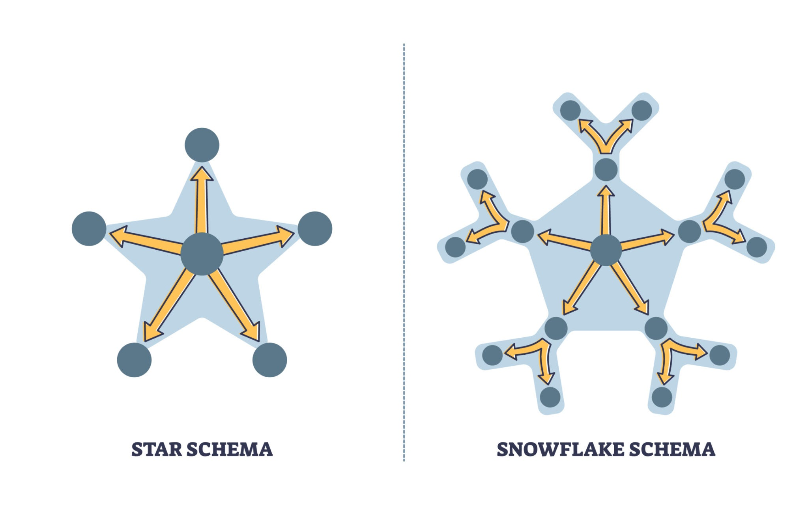

# Power BI & Data Modeling Concepts: Deep Dive

## 1. Architecture: Star Schema vs. Flat Files

**Problem Statement:** Why did we architect a separate `Dim_Category` table instead of utilizing the existing `Category` column within the main `Procurement_Data` fact table?

**Technical Rationale:**
This design optimizes for the **VertiPaq Engine**, the in-memory columnar database technology that powers Power BI.

* **Columnar Storage & Compression:**
* Power BI does not scan data row-by-row; it scans column-by-column. It achieves high performance by compressing repeated values.
* **Scenario A (Flat File - Anti-Pattern):** Storing `Category` text strings (e.g., "Software Licensing") inside a Fact table of 1 million rows forces the engine to scan and index that high-volume column for every filter context. This is a mix of **High Cardinality** and **High Volume**, which degrades performance.
* **Scenario B (Star Schema - Best Practice):** By normalizing `Category` into a dimension table, the Fact table only stores a lightweight integer (Surrogate Key) or pointer. When filtering by "Software," the engine scans the tiny Dimension table (milliseconds) and propagates the filter to the Fact table via the relationship.


* **"Auto-Exist" Optimization:**
*

```
* DAX formulas execute more efficiently when filters originate from Dimension tables. This prevents **Context Ambiguity** and ensures the "Auto-Exist" logic correctly identifies intersection points between columns.
* It promotes reusability; the same `Dim_Category` can filter multiple Fact tables (e.g., `Budget_Plans` and `Actual_Spend`) in a unified model.

```

**Architectural Strategy:** Flat files are acceptable for rapid prototyping. Star Schemas are required for **Scalability**. We separate Dimensions to ensure the dashboard remains responsive even as data volume scales from 100k to 100M rows.

---

## 2. DAX Logic: Defensive Coding with DIVIDE()

**Problem Statement:** Why utilize the function `DIVIDE(_Spend - _Budget, _Budget, 0)` instead of the standard arithmetic operator `(_Spend - _Budget) / _Budget`?

**Error Handling Strategy:**
This implements **Defensive Coding** principles to ensure report stability.

* **The "Divide by Zero" Risk:**
* In mathematical operations, dividing by zero is undefined.
* In a dynamic dashboard, a user might filter for a Category with a `$0` Budget (e.g., a newly initialized project). The formula `Spend / Budget` would evaluate to `Spend / 0`.
* **Consequence:** This results in `Infinity` or `NaN` (Not a Number) errors rendering on the user interface, breaking visuals and degrading trust.


* **The "Safe Fail" Pattern:**
* The `DIVIDE` function includes a built-in exception handler: `DIVIDE(Numerator, Denominator, AlternateResult)`.
* It functions as an optimized `IF` statement: "If the Denominator is 0, return the Alternate Result (0) instead of throwing an error."
* This ensures the User Experience (UX) degrades gracefully rather than crashing.


**Key Insight:** Arithmetic operators (`/`) are brittle in production environments where data quality cannot be guaranteed 100% of the time. `DIVIDE` is the industry standard for robust financial reporting.

---

## 3. Visual Validation: Interpreting the Scatter Plot

**Validation Protocol:** Does the Scatter Plot provide visual confirmation of the Isolation Forest's outputs?

**Visual Analysis:**
Yes, the chart acts as a **Visual Validation** mechanism for the unsupervised learning model.

* **The "Linear Correlation" Baseline:**
* The strong diagonal cluster of blue dots represents the "Normal" data distribution.
* **Statistical Context:** This reflects the covariance programmed into the data generator (`ActualSpend = Budget * Multiplier`). Since the multiplier variance is tight (0.8 to 1.2), normal contracts adhere to a 45-degree trend line.


* **Outlier Separation:**
* **Red Dots (Anomalies):** These data points appear spatially distinct, floating significantly above or below the main diagonal cluster.
* **Algorithm Validation:** The Isolation Forest algorithm successfully identified these points as "easy to isolate" (short path lengths in the decision tree) because they do not share the density characteristics of the main cluster.


* **Business Translation:**
* **Blue Dot (On Line):** "Performance matches expectations."
* **Red Dot (Off Line):** "Significant deviation detected (e.g., Budget $50k vs. Spend $150k). Investigation required."


**System Trust Mechanism:** The Scatter Plot serves as a validation layer. It demonstrates to non-technical stakeholders that the AI is not a "black box," but rather a tool for highlighting mathematical outliers that deviate from established spending trends.